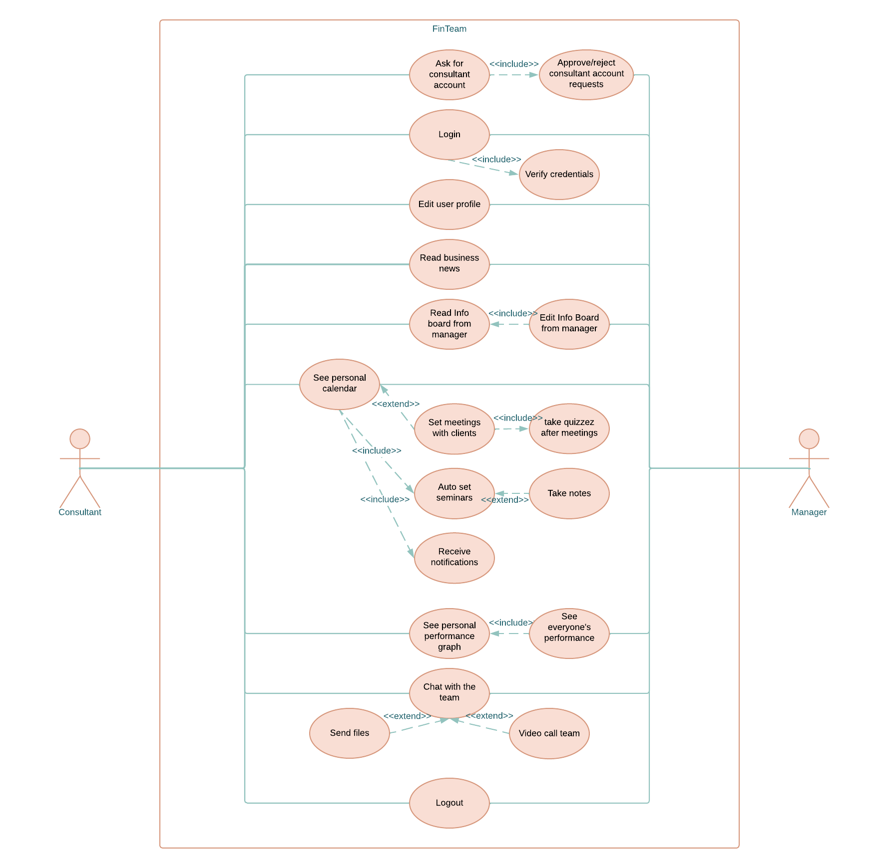

# Investime_backend
 This is a .Net7 API that serves as <u>backend</u> for <u>InvesTime</u> project. 
In order to run it, open the project in a terminal and execute the following command:
```
dotnet run
```

<br>


# Use Case Diagram


<br>

Based on this diagram, this API contains endpoints that satisfy the following:


|                               | Consultant                    |Manager                     |
|------------------------------ | ----------------------------- | -------------------------- |
|Ask for consultant account     | Post consultant request (consultant info)| - get all user requests<br> - approve => insert consultant in database with standard password <br> - decline => delete user request from database|
|Login/Logout                   | Login/Logout as User          |Login/Logout as Admin       |
|Edit user profile              | - Get personal user profile <br> - Edit user profile fields<br> - Change password| -	Get personal user profile <br> - Get personal statistics <br> - Change password<br> -	Get list of all consultants under manager<br> - Delete consultant from database|
|Read business news             | - Get the list of all business news<br> -	Get one business news(external Api)| - Get the list of all business news<br> -	Get one business news(external Api)|
|Read Info board from manager   | - Get all info articles from manager<br> - Search through titles| -	Get all info articles from manager<br> - Search through article titles <br> - Add articles <br> - Edit one article <br> - Delete article|
|See personal calendar          |- Add new meeting<br> - Delete meeting <br> - Get after-quiz questions and post answers to all (in Details section) <br> - Get one meeting <br> - Get all meetings in a month<br>|- Add new meeting<br> - Delete meeting <br> - Get after-quiz questions and post answers to all (in Details section) <br> - Get one meeting <br> - Get all meetings in a month<br> -  Add seminars (auto-set for everyone)|
|See personal performance graph | - Get personal statistics between 2 dates <br> - Get personal list of goals <br> - Add new goal to personal list of goals <br> - Delete one goal from personal list of goals <br>Get performance graph based on: <br>- Nr_meetings/selected period(per types of meetings) <br> - nr clients / auto-set target <br> - nr of contracts signed / nr. clients <br> <br>- Get everyone’s statistics between 2 dates| - Get personal statistics between 2 dates <br> - Get personal list of goals <br> - Add new goal to personal list of goals <br> - Delete one goal from personal list of goals <br>Get performance graph based on: <br>- Nr_meetings/selected period(per types of meetings) <br> - nr clients / auto-set target <br> - nr of contracts signed / nr. clients <br> <br>- Get everyone’s statistics between 2 dates|
|Chat with the team             | -	Send messages<br> - Receive + view messages<br> - Send files<br> - Audio/Video call everyone|  -	Send messages<br> - Receive + view messages<br> - Send files<br> - Audio/Video call everyone|
------------------------------------------------------------------------------------------------------------------------------------------------------------------------------------------------------------------------------------------------------------------------------------------------------------------------------------------------------------------------------------------------------------------------------------------------------------------------------------

<br><br>


### Meeting types:
* Analysis,
* ConsultationC1,
* ConsultationC2,
* Service,
* PersonalMeeting,
* TeamMeeting,
* TellParty,
* Seminar
* Training

<br><br>

## Database records:
<br>

<b>User account:</b>
-	string: Id(auto-generated)
-	string: First Name*
-	string: Last Name*
-	string: Username*
-	string: Password hash*
-	string: Password Salt*
-	bool:   IsAdmin*
-	string: ManagerUsername*
-	string: Email*
-	bool:   EmailConfirmed
-	string: PhoneNumber (added later)
-	bool:   MeetingsNotificationsOff (added later)
-   string: Address (added later)
-   string: City (added later)
<br>

<b>Meeting:</b>
-	string: Id (auto-generated)
-	string: Title (default value: “Meeting”)
-	Date:   Date*
-	String: Time* (format: “HH:mm”)
-	Int:    Duration*
-	string: Location
-	string: MeetingType*
-	string: Description
-	string: MeetingNotes
-	string: ClientName*
-	string: UserId*
<br>

<b>Article:</b>
-   string: Id (auto-generated)
-	string: Title*
-	string: Content* (link)
-	string: Observations
<br>

<b>RegistrationRequest:</b>
-   string: Id
-   string: FirstName*
-   string: LastName*
-   string: Username*
-   string: ManagerUsername*
-   string: Email*
-   Date: DateTime
<br>

<b>UserStatistics:</b>
-   string: Id (auto-generated)
-   string: Username
-	int:    TargetNrOfClientsPerYear
-	int:    ContractsSigned
-	int:    ClientsCount
-	DateTime: UserStatisticsCreatedOn
-	Array<string>: GoalsList
<br>
